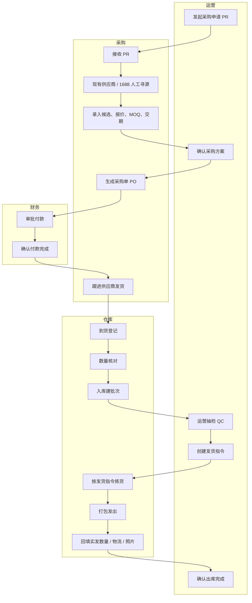

# ERP 采购到出库工作流设计

## 目标

本文档定义第一版轻 ERP 的采购到出库流程，作为后续数据库、页面、权限、局域网协同和 WorkItem 事项系统的业务基准。

第一版目标不是自动化 1688，也不是完整传统 ERP，而是先让团队稳定跑通：

```text
运营发起采购申请
-> 采购人工寻源并生成采购单
-> 财务审批付款
-> 仓库收货入库
-> 运营抽检质检
-> 运营创建发货指令
-> 仓库拣货打包发出
-> 运营确认出库完成
```

## 第一版范围

第一版实现：

- 运营发起采购申请 PR。
- 采购使用现有供应商或人工 1688 寻源。
- 采购录入候选链接、价格、MOQ、交期、物流费和备注。
- 运营确认采购方案。
- 采购生成采购单 PO。
- 财务审批付款并确认付款状态。
- 仓库到货登记、数量核对、入库建批次。
- 运营按百分比抽检质检。
- 质检通过后释放库存。
- 运营创建发货指令。
- 仓库按指令拣货、打包、发出并回填物流信息。
- 运营确认出库完成。
- 系统在关键节点生成 WorkItem。

第一版不实现：

- 1688 官方 API 对接。
- 1688 浏览器自动图搜。
- 1688 自动下单。
- 自动付款。
- 仓库移动端 PWA。
- 复杂供应商评分。
- 复杂 AQL 抽检标准。

但数据结构预留采购来源和寻源方式：

```text
purchase_source: existing_supplier | 1688_manual | other_manual
sourcing_method: manual | browser_automation | official_api
```

第一版只实现 `manual`。

## 角色

### 运营

运营负责需求、质量和发货决策。

- 发起采购申请。
- 确认采购给出的供应商和报价方案。
- 货到后做抽检质检。
- 判断通过、部分通过、不通过或返工。
- 创建发货指令。
- 最终确认出库完成。

### 采购

采购负责找货、下单和供应商交期。

- 接收采购申请。
- 在现有供应商或 1688 人工寻源。
- 录入候选商品和报价。
- 生成采购单。
- 跟进供应商发货。
- 维护采购异常。

### 财务

财务负责付款审批和付款状态。

- 审批采购单付款。
- 确认付款完成。
- 记录付款异常。

### 仓库

仓库负责实物动作。

- 到货登记。
- 数量核对。
- 入库建批次。
- 根据运营发货指令拣货。
- 打包发出。
- 回填实发数量、箱数、物流单号和照片。

### 管理者

管理者负责查看全局和高风险审批。

- 查看所有异常。
- 处理高风险质检放行、超额采购、供应商异常等审批。
- 查看流程追溯和审计记录。

## 泳道流程



## 主单据

第一版主单据如下：

```text
PurchaseRequest              采购申请
SourcingCandidate            寻源候选
PurchaseOrder                采购单
PaymentApproval              付款审批
InboundReceipt               入库单
InventoryBatch               库存批次
InventoryLedgerEntry         库存流水
QCInspection                 运营质检单
OutboundShipment             发货指令 / 出库单
WorkItem                     工作事项
AuditLog                     审计日志
```

## 状态机

### 采购申请 PR

```text
draft
-> submitted
-> buyer_processing
-> sourced
-> waiting_ops_confirm
-> converted_to_po
```

异常状态：

```text
rejected
cancelled
```

状态说明：

- `draft`：运营草稿。
- `submitted`：运营提交，等待采购接单。
- `buyer_processing`：采购处理中。
- `sourced`：采购已录入候选或报价。
- `waiting_ops_confirm`：等待运营确认采购方案。
- `converted_to_po`：已转采购单。
- `rejected`：运营或管理者驳回。
- `cancelled`：流程取消。

### 寻源候选

```text
candidate
-> shortlisted
-> selected
```

异常状态：

```text
rejected
expired
```

第一版候选来源：

```text
existing_supplier
1688_manual
other_manual
```

### 采购单 PO

```text
draft
-> pending_finance_approval
-> approved_to_pay
-> paid
-> supplier_processing
-> shipped
-> arrived
-> inbounded
-> closed
```

异常状态：

```text
delayed
exception
cancelled
```

状态说明：

- `draft`：采购单草稿。
- `pending_finance_approval`：等待财务审批付款。
- `approved_to_pay`：财务同意付款。
- `paid`：财务确认已付款。
- `supplier_processing`：供应商备货或生产中。
- `shipped`：供应商已发货。
- `arrived`：仓库已登记到货。
- `inbounded`：仓库已入库并生成批次。
- `closed`：采购单关闭。

### 入库单

```text
pending_arrival
-> arrived
-> counted
-> inbounded_pending_qc
```

异常状态：

```text
quantity_mismatch
damaged
exception
cancelled
```

### 运营质检 QC

```text
pending_qc
-> in_progress
-> passed
```

其他结果状态：

```text
passed_with_observation
partial_passed
failed
rework_required
exception
```

### 发货指令 / 出库单

```text
draft
-> pending_warehouse
-> picking
-> packed
-> shipped_out
-> pending_ops_confirm
-> confirmed
```

异常状态：

```text
exception
cancelled
```

状态说明：

- `draft`：运营草稿。
- `pending_warehouse`：运营提交，等待仓库处理。
- `picking`：仓库拣货中。
- `packed`：仓库已打包。
- `shipped_out`：仓库已发出，库存已扣减。
- `pending_ops_confirm`：等待运营确认出库完成。
- `confirmed`：运营确认完成。

## 权限矩阵

| 动作 | 运营 | 采购 | 财务 | 仓库 | 管理者 |
| --- | --- | --- | --- | --- | --- |
| 创建 PR | 是 | 否 | 否 | 否 | 是 |
| 接收 PR | 否 | 是 | 否 | 否 | 是 |
| 录入寻源候选 | 否 | 是 | 否 | 否 | 是 |
| 确认采购方案 | 是 | 否 | 否 | 否 | 是 |
| 创建 PO | 否 | 是 | 否 | 否 | 是 |
| 审批付款 | 否 | 否 | 是 | 否 | 是 |
| 确认付款 | 否 | 否 | 是 | 否 | 是 |
| 更新供应商发货 | 否 | 是 | 否 | 否 | 是 |
| 到货登记 | 否 | 否 | 否 | 是 | 是 |
| 数量核对 | 否 | 否 | 否 | 是 | 是 |
| 入库建批次 | 否 | 否 | 否 | 是 | 是 |
| 运营抽检 QC | 是 | 否 | 否 | 否 | 是 |
| 创建发货指令 | 是 | 否 | 否 | 否 | 是 |
| 拣货打包发出 | 否 | 否 | 否 | 是 | 是 |
| 确认出库完成 | 是 | 否 | 否 | 否 | 是 |

## 库存规则

库存不能直接编辑，只能通过业务动作和库存流水变化。

### 入库

仓库入库后：

```text
received_qty 增加
blocked_qty 增加
qc_status = pending
```

入库时写入库存流水：

```text
type = purchase_inbound
source_doc_type = inbound_receipt
```

### QC 通过

运营 QC 通过：

```text
blocked_qty 减少
available_qty 增加
qc_status = passed
```

写入库存流水：

```text
type = qc_release
source_doc_type = qc_inspection
```

### QC 部分通过

运营填写：

```text
release_qty
blocked_qty
rework_qty
```

系统执行：

```text
release_qty -> available_qty
剩余数量 -> blocked_qty 或 rework_qty
qc_status = partial_passed
```

### QC 不通过

系统执行：

```text
blocked_qty 保持
available_qty 不增加
qc_status = failed
禁止创建有效发货指令
```

### 创建发货指令

运营提交发货指令时：

```text
available_qty 减少
reserved_qty 增加
```

这一步代表库存被发货指令占用，但还没有真实出库。

### 仓库确认发出

仓库确认发出时：

```text
reserved_qty 减少
写 outbound_to_temu 库存流水
```

库存扣减发生在仓库确认已发出这一刻。

### 运营确认出库完成

运营确认完成只关闭业务流程，不重复扣库存。

## QC 百分比规则

第一版使用简单百分比规则。

```text
不良率 = 不良数量 / 实际抽检数量
```

默认判定：

| 不良率 | 判定 | 库存动作 | 事项 |
| --- | --- | --- | --- |
| 0% | 通过 | 整批释放 | 无 |
| 大于 0% 且小于等于 5% | 通过但观察 | 整批释放 | P2 观察事项 |
| 大于 5% 且小于等于 15% | 部分通过 | 运营填写释放、锁定、返工数量 | P1 部分放行事项 |
| 大于 15% | 不通过 | 整批锁定 | P0 质检异常事项 |

第一版默认阈值：

```text
观察阈值 = 5%
失败阈值 = 15%
```

后续可以在设置中配置。

## WorkItem 事项规则

### 运营事项

| 触发条件 | 类型 | 优先级 | 完成条件 |
| --- | --- | --- | --- |
| PR 进入 waiting_ops_confirm | PURCHASE_PLAN_CONFIRM | P1 | 运营确认或驳回采购方案 |
| 批次入库后 pending_qc | QC_INSPECTION_PENDING | P1 | QC 完成 |
| QC 不良率大于 15% | QC_FAILED | P0 | 处理锁定、返工或退供方案 |
| QC 部分通过 | QC_PARTIAL_RELEASE | P1 | 填写并确认释放、锁定、返工数量 |
| 有可用库存待发货 | OUTBOUND_PLAN_PENDING | P2 | 创建发货指令或关闭事项 |
| 仓库已发出待确认 | OUTBOUND_CONFIRM_PENDING | P1 | 运营确认出库完成 |

### 采购事项

| 触发条件 | 类型 | 优先级 | 完成条件 |
| --- | --- | --- | --- |
| PR submitted | PURCHASE_REQUEST_PENDING | P1 | 采购接单 |
| PR buyer_processing 超过 24 小时 | SOURCING_DELAY | P1 | 录入寻源候选 |
| 采购方案已确认 | PO_CREATE_PENDING | P1 | 生成 PO |
| PO paid | SUPPLIER_FOLLOW_UP | P2 | 更新供应商处理或发货状态 |
| PO 到交期仍未发货 | SUPPLIER_DELIVERY_DELAY | P0 | 更新延期原因或处理方案 |

### 财务事项

| 触发条件 | 类型 | 优先级 | 完成条件 |
| --- | --- | --- | --- |
| PO pending_finance_approval | PAYMENT_APPROVAL_PENDING | P1 | 财务审批通过或驳回 |
| PO approved_to_pay | PAYMENT_CONFIRM_PENDING | P1 | 财务确认付款完成 |
| 付款失败或金额不一致 | PAYMENT_EXCEPTION | P0 | 处理异常 |

### 仓库事项

| 触发条件 | 类型 | 优先级 | 完成条件 |
| --- | --- | --- | --- |
| PO shipped | WAREHOUSE_RECEIVE_PENDING | P1 | 仓库登记到货 |
| 已到货未核数 | WAREHOUSE_COUNT_PENDING | P1 | 完成数量核对 |
| 已核数未入库 | WAREHOUSE_INBOUND_PENDING | P1 | 入库建批次 |
| 出库单 pending_warehouse | PICKING_PENDING | P1 | 开始拣货 |
| 出库单 picking | PACKING_PENDING | P1 | 完成打包 |
| 出库单 packed | SHIP_OUT_PENDING | P1 | 发出并回填物流 |
| 实发数量不一致 | OUTBOUND_EXCEPTION | P0 | 运营或管理者处理 |

## 异常分支

### 采购异常

- 供应商无货。
- 1688 链接失效。
- 价格变化。
- MOQ 不满足。
- 交期无法满足。
- 采购数量变化。

处理方式：

```text
采购录入异常原因
-> 生成 WorkItem
-> 运营确认是否更换方案、降量、取消或重新寻源
```

### 财务异常

- 财务拒绝付款。
- 付款金额与 PO 不一致。
- 付款失败。
- 供应商账户异常。

处理方式：

```text
财务录入异常
-> PO 进入 exception
-> 生成 P0/P1 WorkItem
-> 采购或运营处理
```

### 入库异常

- 到货少件。
- 到货多件。
- 包装破损。
- SKU 与采购单不匹配。
- 无法识别来源。

处理方式：

```text
仓库录入差异
-> 入库单进入 exception 或 quantity_mismatch
-> 生成仓库/采购/运营事项
```

### QC 异常

- 不良率超过 15%。
- 实物与参考图不一致。
- 包装或标签不符合要求。
- 需要返工。

处理方式：

```text
运营提交 QC 异常
-> 批次锁定
-> 禁止发货
-> 生成 P0 事项
```

### 出库异常

- 库存不足。
- 批次不可用。
- 实发数量不一致。
- 缺少物流单号。
- 包装照片缺失。

处理方式：

```text
仓库标记异常
-> 出库单进入 exception
-> 库存预留按实际情况释放或保持
-> 运营处理
```

## 页面草案

第一版页面按角色组织。

### 运营工作台

- 待确认采购方案。
- 待质检批次。
- QC 异常。
- 可发货库存。
- 待确认出库完成。

### 采购工作台

- 待处理 PR。
- 寻源候选录入。
- 待生成 PO。
- 待跟进发货。
- 采购异常。

### 财务工作台

- 待审批付款。
- 待确认付款。
- 付款异常。

### 仓库工作台

- 待收货。
- 待核数。
- 待入库。
- 待拣货。
- 待打包。
- 待发出。
- 仓库异常。

### 管理者工作台

- 今日 P0。
- 所有异常。
- 审批中心。
- 流程追溯。

## 技术实现约束

- 采购、财务、仓库局域网 Web 不依赖 `window.electronAPI`。
- Electron 主控台通过 IPC 调 ERP service。
- 局域网 Web 通过 HTTP API 调同一套 ERP service。
- `automation/worker.mjs` 不对局域网开放。
- SQLite 只在主机上运行。
- 业务写操作必须走 transaction。
- 库存变动必须写 `InventoryLedgerEntry`。
- 关键动作必须写 `AuditLog`。
- 所有业务数据必须带 `accountId`。

## 第一版验收标准

- 运营能发起 PR。
- 采购能录入现有供应商或 1688 人工候选。
- 运营能确认采购方案。
- 采购能生成 PO。
- 财务能审批并确认付款。
- 采购能更新供应商发货状态。
- 仓库能到货、核数、入库建批次。
- 入库后库存默认不可发货。
- 运营能按百分比抽检 QC。
- QC 通过后库存释放为可发货。
- QC 不通过后库存锁定且不能发货。
- 运营能创建发货指令。
- 创建发货指令后库存进入预留。
- 仓库能拣货、打包、确认发出。
- 仓库确认发出后库存扣减。
- 运营能确认出库完成。
- 每个关键节点都有 WorkItem 和审计记录。

