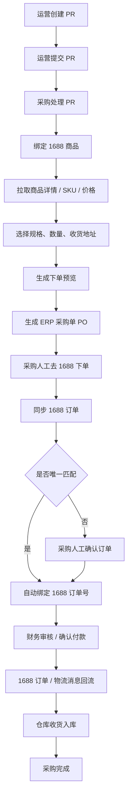

# ERP 采购流程设计文档

日期：2026-04-29

状态：正式设计稿 v1

## 1. 目标

本文档定义 Temu 自动化运营工具第一阶段 ERP 采购流程的运行方式、数据归属、角色分工、核心单据、1688 接入边界和后续开发顺序。

第一阶段目标不是做一个对外 SaaS，也不是完全复刻传统 ERP，而是先让公司内部的运营、采购、财务、仓库围绕同一套客户端 ERP 和同一份云端数据协作。

核心目标：

- 所有人使用同一个客户端 ERP 登录。
- 云端是唯一正式数据源。
- 运营和采购分工清楚。
- 一个采购需求对应一个 1688 订单。
- 第一版只做到下单预览、生成 ERP 采购单、自动或半自动绑定 1688 订单号。
- 暂不由系统直接创建真实 1688 订单，暂不自动付款。

## 2. 参考聚水潭的设计原则

本系统参考聚水潭的成熟 ERP 边界，但不照搬全部复杂度。

可借鉴的原则：

1. 采购单是核心业务单据。
   采购需求只是入口，真正进入财务、在途、收货、库存闭环的是采购单。

2. 基础资料先行。
   供应商、商品、店铺、仓库、收货地址、1688 账号、用户权限都属于流程运行前的基础资料。

3. 1688 不是单个下单按钮，而是一套映射关系。
   需要处理 1688 账号授权、商品映射、规格/SKU 映射、供应商信息、订单号绑定。

4. 消息推送是自动化层，不是业务入口。
   1688 消息用于更新已有采购单的订单、物流、售后状态，不替代 ERP 内部采购流程。

参考资料：

- 聚水潭采购单管理：https://www.erp321.com/app/wiki/historydetail.aspx?id=111&logid=592
- 聚水潭 1688 一键下单说明：https://www.erp321.com/app/wiki/historydetail.aspx?id=908&logid=2117
- 聚水潭开放平台接入流程：https://open.jushuitan.com/document/2037.html
- 聚水潭消息推送说明：https://open.jushuitan.com/document/2119.html

## 3. 系统运行模式

第一阶段系统是公司内部 ERP，不是多租户 SaaS。

虽然数据库保留公司表，但当前只启用一个公司：

```text
company_default
```

统一入口：

```text
员工电脑客户端 ERP
        |
        | HTTPS
        v
https://erp.temu.chat
        |
        v
云服务器 ERP 服务
        |
        v
正式数据库 /opt/temu-erp-data/erp.sqlite
```

管理员、运营、采购、财务、仓库都登录同一个客户端 ERP。区别不是入口不同，而是登录后能看到的菜单、单据和操作不同。

服务器只负责 API、数据库、1688 消息接收、备份、定时任务和部署。业务人员不直接登录服务器操作业务。

## 4. 数据保存规则

正式业务数据只保存在云端数据库：

```text
/opt/temu-erp-data/erp.sqlite
```

服务器备份目录：

```text
/opt/temu-automation/backups
```

客户端本地只保存：

- 登录状态。
- 客户端运行配置。
- 临时缓存。
- 开发测试数据。
- 调试日志。

本地客户端不再作为正式业务数据库使用。后续如果发现本地和云端数据不一致，以云端为准。

当前服务器长期运行方式：

```text
temu-erp.service 负责 ERP Node 服务
caddy 负责 HTTPS 和反向代理
```

不再使用临时 `nohup node scripts/erp-server.cjs` 进程作为正式运行方式。

## 5. 角色分工

### 5.1 管理员

管理员也登录客户端 ERP。

管理员权限：

- 用户管理。
- 角色权限配置。
- 1688 授权配置。
- 收货地址配置。
- 店铺、仓库、1688 账号范围配置。
- 查看和处理全部采购单据。
- 查看日志和异常。

### 5.2 运营

运营负责提出采购需求和跟踪业务结果。

运营权限：

- 创建采购需求单 PR。
- 编辑自己的草稿 PR。
- 提交 PR 给采购。
- 查看自己相关 PR/PO 的进度。
- 补充商品图片、链接、关键词、目标成本、目标数量、备注要求。

运营不负责在 1688 下单，不负责付款审核。

### 5.3 采购

采购负责找货、选规格、确认价格、生成采购单、绑定 1688 订单。

采购权限：

- 查看已提交 PR。
- 认领或处理 PR。
- 绑定 1688 商品链接或商品 ID。
- 拉取 1688 商品详情、SKU、规格、价格。
- 选择供应商、SKU、数量、收货地址。
- 生成下单预览。
- 从下单预览生成 ERP 采购单 PO。
- 人工去 1688 完成真实下单。
- 同步或确认绑定 1688 订单号。

### 5.4 财务

财务负责付款相关审核和状态确认。

财务权限：

- 查看待付款 PO。
- 审核付款。
- 标记已付款。
- 查看采购金额、供应商、1688 订单号和付款凭证。

第一阶段不做自动付款。

### 5.5 仓库

仓库负责实物收货和入库。

仓库权限：

- 查看已绑定 1688 订单且进入运输/待收货状态的 PO。
- 登记到货。
- 核对数量。
- 记录异常。
- 入库。

## 6. 核心业务流程

第一阶段主流程：

```text
运营创建采购需求 PR
-> 运营提交 PR
-> 采购处理 PR
-> 采购绑定 1688 商品
-> 系统拉取商品详情、SKU、价格
-> 采购选择规格、数量、收货地址
-> 系统生成下单预览
-> 采购确认并生成 ERP 采购单 PO
-> PO 进入待 1688 下单
-> 采购人工去 1688 下单
-> 系统同步最近 1688 订单并自动匹配
-> 匹配成功后自动回填 1688 订单号
-> 财务审核和确认付款
-> 1688 订单/物流消息回流
-> 仓库收货入库
-> PO 完成
```

流程图：



## 7. 核心单据

### 7.1 采购需求单 PR

PR 由运营创建，用于表达业务需求。

关键字段：

- PR 编号。
- 创建人。
- 目标店铺。
- 商品名称。
- 商品图片。
- 商品链接。
- 关键词。
- 需求数量。
- 目标成本。
- 期望到货时间。
- 备注要求。
- 状态。
- 关联采购员。
- 关联 PO。

### 7.2 寻源候选 Sourcing Candidate

采购处理 PR 时，可以保存一个或多个候选 1688 商品。

关键字段：

- 候选 ID。
- PR ID。
- 1688 商品 ID。
- 1688 商品链接。
- 供应商名称。
- 商品标题。
- 图片。
- SKU/规格。
- 阶梯价。
- MOQ。
- 运费。
- 采购备注。
- 原始 1688 响应 JSON。

第一阶段可以只选择一个候选商品进入下单预览。

### 7.3 下单预览 Order Preview

下单预览不是正式采购单，是采购确认前的检查页面。

显示内容：

- 1688 账号。
- 商品。
- 供应商。
- SKU/规格。
- 数量。
- 单价。
- 运费。
- 总金额。
- 收货地址。
- 预计订单明细。
- 1688 预览接口返回内容。
- 异常提示。

下单预览确认后，生成正式 PO。

### 7.4 采购单 PO

PO 是 ERP 内部正式单据。

关键字段：

- PO 编号。
- PR 编号。
- 采购员。
- 运营负责人。
- 1688 账号。
- 1688 商品 ID。
- 1688 商品链接。
- 供应商名称。
- SKU/规格。
- 数量。
- 单价。
- 运费。
- 总金额。
- 收货地址。
- 1688 订单号。
- 付款状态。
- 物流状态。
- 入库状态。
- 状态。
- 创建时间。
- 更新时间。

## 8. 状态设计

### 8.1 PR 状态

```text
draft
-> submitted
-> buyer_processing
-> preview_ready
-> converted_to_po
```

异常状态：

```text
cancelled
```

说明：

- `draft`：运营草稿。
- `submitted`：运营已提交，采购可见。
- `buyer_processing`：采购处理中。
- `preview_ready`：已生成下单预览，等待确认生成 PO。
- `converted_to_po`：已生成采购单。
- `cancelled`：已取消。

第一阶段不加运营主管审核。

### 8.2 PO 状态

```text
pending_1688_order
-> awaiting_order_sync
-> order_bound
-> pending_payment
-> paid
-> shipping
-> received
-> inbounded
-> completed
```

异常状态：

```text
exception
cancelled
```

说明：

- `pending_1688_order`：已生成 PO，等待采购去 1688 人工下单。
- `awaiting_order_sync`：采购已下单，等待系统同步或匹配 1688 订单。
- `order_bound`：已绑定 1688 订单号。
- `pending_payment`：待财务审核或确认付款。
- `paid`：已付款。
- `shipping`：运输中。
- `received`：仓库已收货。
- `inbounded`：已入库。
- `completed`：采购闭环完成。
- `exception`：金额、数量、物流、售后等异常。
- `cancelled`：取消。

硬规则：

- 没有 1688 订单号的 PO 不能进入 `shipping`、`received`、`inbounded`、`completed`。
- 一个 PR 默认只生成一个 PO。
- 一个 PO 默认只绑定一个 1688 订单。

## 9. 1688 接入边界

第一阶段使用 1688 能力：

- 1688 OAuth 授权。
- 商品详情。
- SKU/规格价格。
- 收货地址配置。
- 下单预览。
- 买家订单列表同步。
- 买家订单详情同步。
- 物流信息同步。
- 订单、物流、售后消息接收。

第一阶段不做：

- 系统直接创建真实 1688 订单。
- 系统自动付款。
- 系统自动合并多个 PR 下单。
- 系统自动拆分一个 PR 到多个 1688 订单。

采购真实下单动作仍在 1688 页面人工完成。

## 10. 1688 订单自动回填

由于业务规则是一个采购需求对应一个 1688 订单，系统可以做较高成功率的自动回填。

匹配依据：

- 1688 账号。
- 1688 商品 ID。
- SKU/规格。
- 数量。
- 金额。
- 供应商。
- 下单时间窗口。

匹配结果：

1. 唯一匹配。
   系统自动写入 `1688_order_id`，PO 进入 `order_bound`。

2. 没有匹配。
   PO 保持 `awaiting_order_sync`，提示采购稍后同步或手动输入订单号。

3. 多个匹配。
   进入人工确认界面，采购选择正确订单后绑定。

后续 1688 消息推送进入 `/api/1688/message` 后，也按订单号更新对应 PO。

## 11. 权限模型

第一阶段权限按以下维度控制：

- 菜单权限。
- 单据权限。
- 动作权限。
- 店铺范围。
- 仓库范围。
- 1688 账号范围。

角色权限初始建议：

| 角色 | 菜单 | 单据 | 动作 |
| --- | --- | --- | --- |
| 管理员 | 全部 | 全部 | 全部 |
| 运营 | 采购需求、商品、店铺、日志 | 自己相关 PR/PO | 创建 PR、提交 PR、查看进度 |
| 采购 | 采购处理、1688 商品、采购单 | 已提交 PR、自己处理的 PO | 处理 PR、生成预览、生成 PO、同步订单 |
| 财务 | 付款审核、采购单 | 待付款 PO | 审核付款、确认付款 |
| 仓库 | 收货入库 | 待收货 PO | 收货、入库、登记异常 |

管理员也通过客户端 ERP 操作，不另做独立后台入口。

## 12. 数据模块划分

后端模块建议按业务边界拆分：

```text
company          公司基础资料
users            用户、角色、权限
stores           店铺
warehouses       仓库
accounts_1688    1688 授权账号
suppliers        供应商
addresses        收货地址
purchase_requests 采购需求 PR
sourcing         寻源候选
purchase_orders  采购单 PO
payments         付款审核
inbound          收货入库
messages_1688    1688 消息事件
audit_logs       审计日志
```

## 13. 第一阶段开发范围

优先开发：

1. 采购需求单 PR。
2. 采购处理台。
3. 1688 商品详情、规格价格接口。
4. 收货地址配置。
5. 下单预览。
6. 从预览生成 PO。
7. 同步 1688 最近订单。
8. 自动匹配并回填 1688 订单号。
9. 财务付款状态。
10. 1688 消息按订单号关联 PO。

暂缓开发：

- 多公司 SaaS。
- 自动创建真实 1688 订单。
- 自动付款。
- 复杂供应商评分。
- 多 PR 合并下单。
- 一个 PR 拆多订单。
- 移动端仓库 PDA。

## 14. 运维和上线规则

正式服务入口：

```text
https://erp.temu.chat
```

正式服务进程：

```text
temu-erp.service
```

正式数据库：

```text
/opt/temu-erp-data/erp.sqlite
```

备份目录：

```text
/opt/temu-automation/backups
```

上线规则：

1. 本地开发。
2. 本地构建和测试。
3. 推送代码。
4. 服务器更新代码。
5. 运行数据库迁移。
6. 重启 `temu-erp.service`。
7. 验证 `/health`、登录、关键 API。
8. 保留上线前数据库备份。

禁止把临时手动进程作为长期服务。

## 15. 成功标准

第一阶段完成后，应该能跑通以下真实业务：

1. 管理员在客户端 ERP 创建运营、采购、财务、仓库账号。
2. 运营创建采购需求并提交。
3. 采购看到需求，绑定 1688 商品。
4. 系统拉取商品详情、规格价格。
5. 采购选择 SKU、数量、收货地址。
6. 系统生成下单预览。
7. 采购确认生成 ERP 采购单。
8. 采购人工去 1688 下单。
9. 系统同步并自动绑定 1688 订单号。
10. 财务确认付款状态。
11. 1688 订单和物流消息回流后自动更新采购单。
12. 仓库按采购单收货入库。

第一阶段的核心验收不是功能数量，而是这条链路能被运营、采购、财务、仓库真实使用。

